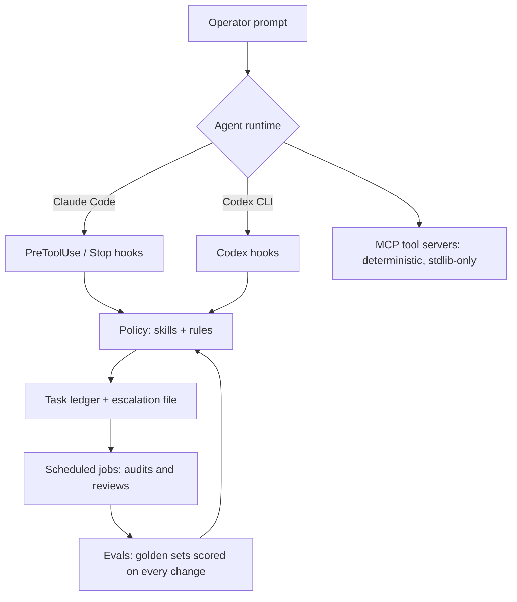

# Architecture of the system these excerpts come from

The private system is an operating layer for autonomous coding agents. Two agent
runtimes (Claude Code and OpenAI Codex CLI) run against the same policy, the same
task ledger and the same hook contracts. This page explains the layers so the
excerpts in this repository make sense in context.

## Layer by layer

| Layer | What it does | Excerpt in this repo |
|---|---|---|
| Runtime hooks | Enforce security and quality rules mechanically, at tool-call time, with exit codes the runtime honours. Rules live in code, not in the prompt. | `hooks/claude-code/`, `hooks/codex/` |
| Policy (skills) | Procedural knowledge the agent loads on demand: how to track tasks, how to treat untrusted data, how to design an eval, what to do after a secret leak. | `skills/` |
| Ledger + escalation | Nothing is dropped. Every finding, deferred fix or owner-gated item becomes a row; anything the agent cannot decide becomes a structured escalation instead of a guess. | described only (private) |
| Scheduled jobs | Daily and interval jobs re-audit the estate: hook integrity, ledger health, model routing, drift between the two runtimes. | `scripts/agents-md-drift.sh` |
| Evals | Golden JSONL sets with expected verdicts. A runner scores the current classifier and fails the build on regression. | `evals/` |
| MCP tool servers | Tools exposed to the agent over the Model Context Protocol. The design servers here emit HTML/CSS/SVG instead of calling paid image APIs. | `mcp-servers/atelier/` |

## Principles that shaped it

1. **Enforce with hooks, guide with prompts.** A rule that matters gets a hook with a
   selftest. The prompt explains the rule; the hook makes it true.
2. **Fail loudly, never silently.** Blocked means exit 2 and a reason on stderr.
   Unknown means an escalation entry, not a best guess.
3. **Evals before opinions.** Behaviour changes are measured against golden sets that
   were written before the change.
4. **Cheapest capable model per task.** Routine work is delegated to smaller models;
   judgment, security and irreversible actions stay on the strongest one.
5. **Provenance on every external claim.** Research output carries source, verbatim
   quote, rewrite and confidence, or it says "no source found".
6. **Two runtimes, one contract.** The Claude Code and Codex configurations are
   checked for drift so the same rule cannot quietly diverge.
