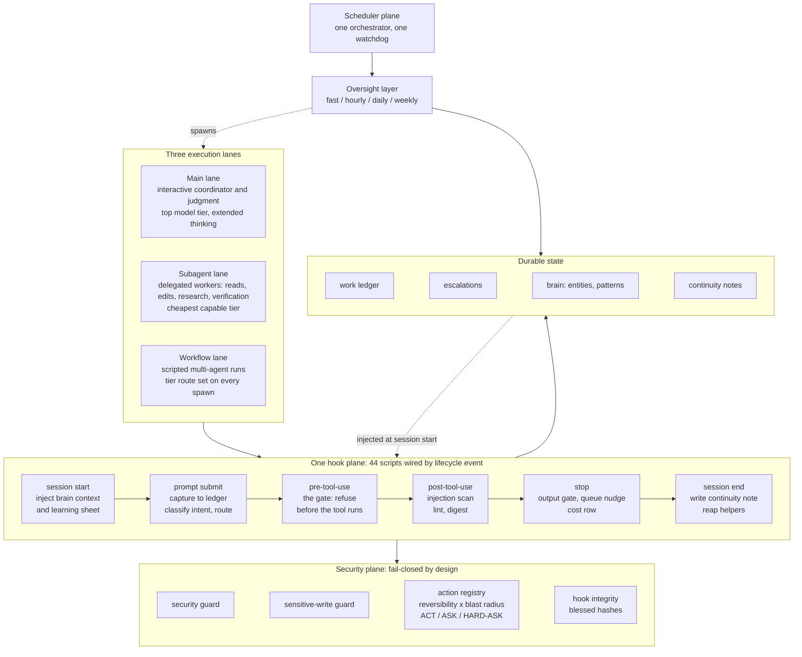

# System atlas: the estate at a glance

The private system is a two-runtime AI operating environment: Claude Code and a second
vendor's agent CLI. This page is an excerpt of two separate inventories of it. They were taken by different instruments on
different days, so their counts do not match each other and were not reconciled by
hand:

| Inventory | Method | Date | Headline |
|---|---|---|---|
| Component register | Every component page shows where it lives, what it does and what has been verified; four proof layers graded independently | September 2026 | 2,692 components · 3,123 relationships · 10 categories |
| Generated system diagram | Drawn by a script from a single machine-generated counts file, so nothing is counted twice | 2026-09-18 | 63 nodes across 12 planes |

Everything below is descriptive. None of it is verifiable from this repository.

## Counts line (generated diagram, 2026-09-18)

Read from one machine-generated counts file; the diagram never counts twice.

| Kind | Count |
|---|---|
| Agents (subagent definitions) | 38 |
| Hooks | 44 |
| Commands | 8 |
| Prompts | 10 |
| Skills | 57 |
| Python scripts | 45 |
| Shell scripts | 237 |
| Oversight scripts | 111, of which 67 scheduled |
| Scheduler manifest rows (recurring jobs) | 159 |
| Repositories | 40 |

## Category map (component register, September 2026)

2,692 components in 10 categories, with 3,123 declared relationships between them.
The overview map aggregates those into 22 category-to-category connections. Lines mean
recorded relationships, not live traffic.

| Category | Components |
|---|---|
| Capabilities | 1,786 |
| Automation | 276 |
| Integrations | 187 |
| Knowledge | 182 |
| Coordination | 120 |
| Projects | 100 |
| New build | 23 |
| Runtimes | 10 |
| Computers | 5 |
| Recovery | 3 |

The register is explicit about what it is not: it inventories 2,692 components but
carries passing runtime evidence for only 7 of them, and keeps 11 recorded gaps visible
rather than hiding them. Discovery is not a health check. Unknown states remain visible.

## Three execution lanes, one hook plane

**Main lane.** The interactive session is the coordinator and judgment layer. It is
pinned to the top model tier with extended thinking, and anything with judgment,
synthesis, security or irreversibility in it stays there.

**Subagent lane.** Delegated workers handle reads, edits, research and verification on
the cheapest capable model tier. The rule is escalate on doubt, never degrade: a
too-cheap model on judgment work is a correctness failure; a too-expensive model on
routine work only costs money.

**Workflow lane.** Scripted multi-agent runs. A model-tier route must be set explicitly
on every spawn, and a gate hook enforces that.

All three lanes pass through the same hook plane. Policy lives there rather than in
prose: a hook that returns non-zero stops the call.

## Hook plane by lifecycle event (2026-09-18)

44 hook scripts wired by event through the runtime settings file.

| Event | Wired | What runs there |
|---|---|---|
| Session start | 2 | Injects brain context and a learning sheet |
| Prompt submit | 5 | Captures the prompt, classifies intent, routes capability |
| Pre-tool-use | 9 | The gate. Refuses unsafe calls before the tool runs |
| Post-tool-use | 5 | Scans for injection, lints, digests |
| Stop | 5 | Anti-sycophancy gate, queue nudge, cost row |
| Session end | 3 | Writes a continuity note; reaps orphaned browser and helper processes |
| Seven further events | 1 script | One telemetry script on 7 further events |

Every hook is classified by failure direction: blocking guards fail closed, advisory
scanners fail open, and known limitations are recorded rather than removed.

## Security plane

Fail-closed by design.

- A pre-tool-use security guard refuses secrets exposure, remote-code pipes into a
  shell, mass deletion and remote-access vectors.
- A sensitive-write guard protects the core rule files, the standing-rules text, the
  settings files and the routing config from unguarded edits.
- An action registry scores every action by reversibility times blast radius and
  resolves it to ACT, ASK or HARD-ASK.
- Hook integrity: hook scripts are hash-stamped against a blessed manifest. Any CHANGED
  row is investigated before re-blessing.
- A model-route gate enforces cheapest-capable-tier per spawn.
- A token-cost ledger hook logs a cost row per turn and, by rule, reports cost but
  never blocks or downgrades a task.

## Scheduler plane and cadence bands

OS scheduler entries tick a single orchestrator that dispatches every recurring job from a
manifest, with a grace period and mode per row. A separate watchdog scheduler entry
watches the orchestrator itself to catch a dead ticker.

The oversight layer is 111 scripts, 67 of them scheduled, in four cadence bands.
Individual jobs are not named here.

| Band | Cadence | What lives there |
|---|---|---|
| Fast interval | 5 to 30 minutes | Relays, sentinels and responders that must notice within the hour |
| Hourly | 1 to 6 hours | Liveness, escalation triage and reasoning passes |
| Daily | 35 rows between early morning and late evening | Audit, routing, briefing and growth |
| Weekly | once a week | Deep audits, security sweeps, scoring and a tech radar |

Cadence descriptions are designed behaviour. Uptime is not measured on this page; the
90-day evidence page carries a measured liveness figure.

## Memory, ledgers and escalation

- Durable memory is split into an action, intent and routing canon; entity facts with
  temporal validity, one file per person, system or project; and a recurring-problems
  file injected into every session, where twice-failed issues are promoted.
- Ledger principle: nothing is done until it is written down. A hook-enforced work
  ledger holds captured prompts and agent-filed findings; done rows rotate to an
  append-only archive.
- Blockers needing human hands, credentials or judgment go to a structured escalation
  file governed by a written protocol.
- A separate propose-only growth system runs under its own written constitution. It
  audits daily, measures growth with an externally counted metric (never a model
  self-rating) and cannot auto-apply outside the constitution's hard-rule bounds.

## Backups and replication

A daily script packs canon, hooks, scripts and brains with four sha256 stamps and a
verified zip. A daily janitor enforces retention. A replication pack reproduces the
counts on a fresh machine. Eviction moves files to an archive rather than deleting.
Local models are used only for low-stakes background plumbing, never for reasoning.
Code is pushed only when asked and never force-pushed to shared branches.

## Four layers of proof

Each component in the register carries a panel with four layers, graded independently:
Source, Installed, Runtime, Outcome. States are explicit (PASS, BLOCKED, UNKNOWN) and a
green in one layer is never inherited by another. Missing fields render as "Not
recorded" rather than being inferred.

What that looks like in the record:

- A source-layer verifier exited 0 with all layers passing, including 20
  provider-identity tests and 8 quoted-fragment tests.
- Regression coverage: 159 bridge cases and 142 path regressions pass; 12
  environment-specific pinned-guard cases were skipped and reported as skipped, not
  passed.
- When a layer was not exercised, the record says "Installed layer was explicitly not
  run" instead of leaving it blank.
- The installed-layer verifier was denied by an active pre-tool-use guard hook. The
  record marks that layer BLOCKED pending attended review rather than green.
- Runtime evidence for the second agent runtime came from a deliberate deny-probe that
  the guard hook blocked with the exact expected denial. Scope is stated narrowly: a
  passing probe "proves this dispatch path only", and an unmeasured transition is
  labelled unmeasured.
- The register caught a config-versus-docs drift: the live hook wiring for the second
  runtime differed from the wiring its adapter document described.

Accountability tallies in the register: 20 recorded checks, 11 open gaps, 9
audit-history entries, 3 resolved check limitations. A blank or unmeasured field is
never treated as a pass.

## How the parts gate each other

A prompt enters the main lane. Before the model sees it, session-start hooks have
already injected the brain context and the learning sheet; prompt-submit hooks capture
it to the ledger and classify its intent, which decides the model route for anything
the session delegates.

When the model calls a tool, the pre-tool-use gate runs first. The security guard, the
sensitive-write guard and the action registry each get a veto; any non-zero exit stops
the call. Subagent and workflow lanes pass through the same gate, with a route check on
every spawn.

After the tool returns, post-tool-use hooks scan the output for injection and label
what is untrusted. At stop, the output gate checks the answer, the queue nudge flags
un-triaged ledger rows, and the cost row lands.

Outside any session, the orchestrator ticks the scheduled jobs; the watchdog ticks the
orchestrator; hook integrity checks the gate itself against blessed hashes; the
oversight layer audits the results and writes findings back into the same ledger and
escalation file that the next session-start hook will inject. The growth system reads
all of it and may only propose.

## What this page does not claim

- That the estate is healthy. The register carries passing runtime evidence for 7 of
  2,692 components and says so.
- That the counts agree. Two instruments, two dates, two sets of numbers.
- That cadence equals uptime. Designed behaviour is described here; measured liveness
  is on the 90-day page.
- That the atlas is a remote-device inventory. It is a private observed snapshot,
  limited to the recorded scope and receipts.

The component register is a self-contained static page: no remote libraries, no
telemetry, no background probes, no live control actions. The register's own footer
warns that its paths may contain private machine information and should be reviewed
before sharing. They were.

---
Excerpt of a private system · numbers as measured on the stated date · portions intentionally omitted
